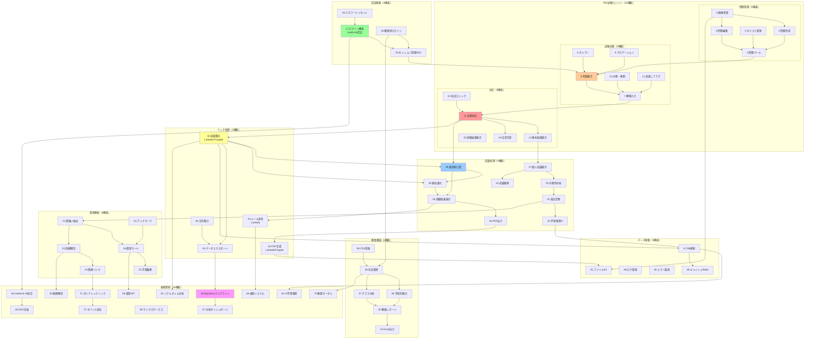
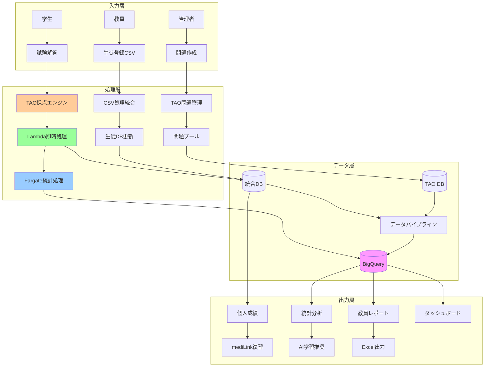
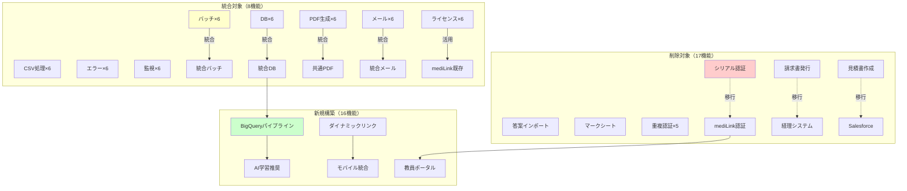
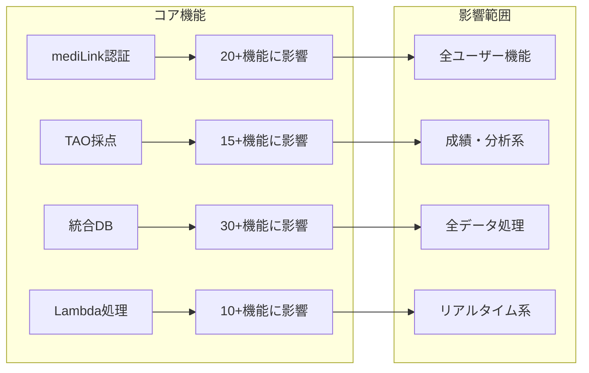
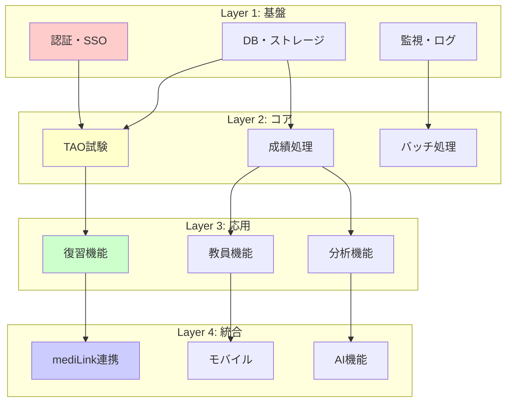
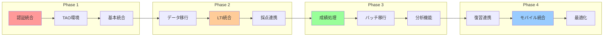

# 機能関連図
## 92機能の相互関係と統合フロー

---

## 🔄 全体機能関連図

---

## 🔗 主要な統合フロー

### 1️⃣ 試験実施フロー

```mermaid
graph LR
    subgraph "試験準備"
        A1[mediLink認証] --> A2[試験一覧]
        A2 --> A3[試験選択]
    end
    
    subgraph "TAO実施"
        A3 --> B1[問題表示]
        B1 --> B2[解答入力]
        B2 --> B3[一時保存]
        B3 --> B4[試験終了]
    end
    
    subgraph "即時処理"
        B4 --> C1[自動採点]
        C1 --> C2[点数表示]
        C2 --> C3[Lambda起動]
        C3 --> C4[基本集計]
    end
    
    subgraph "バッチ処理"
        C4 --> D1[全員終了待ち]
        D1 --> D2[Fargate起動]
        D2 --> D3[偏差値計算]
        D3 --> D4[順位計算]
        D4 --> D5[詳細結果生成]
    end
    
    subgraph "復習誘導"
        D5 --> E1[弱点分析]
        E1 --> E2[復習コンテンツ]
        E2 --> E3[ダイナミックリンク]
        E3 --> E4[mediLink内学習]
    end
    
    style A1 fill:#99ff99
    style B1 fill:#ffcc99
    style C1 fill:#ff9999
    style D2 fill:#99ccff
    style E3 fill:#ff99ff
```

---

## 🔄 データフロー図

---

## 🏗️ システム統合マップ

---

## 📊 機能依存関係マトリックス

### 高依存度機能（他機能への影響大）

### 機能グループ間の関係

---

## 🎯 クリティカルパス

---

## ✅ 機能関連の要点

### 最重要な統合ポイント

1. **認証基盤（影響：全機能）**
   - mediLink認証が全ての起点
   - SSO実装で全システム連携

2. **TAO採点（影響：成績系15機能）**
   - 採点データが後続処理の基盤
   - Lambda/Fargateへの連携が鍵

3. **統合DB（影響：30機能）**
   - 6DB→1DBで全データ統合
   - BigQueryパイプラインへの入口

4. **ダイナミックリンク（影響：学習系10機能）**
   - 復習機能とコンテンツ連携
   - mediLinkエコシステムの要

---

最終更新: 2025-08-20
作成者: Claude Code Assistant
